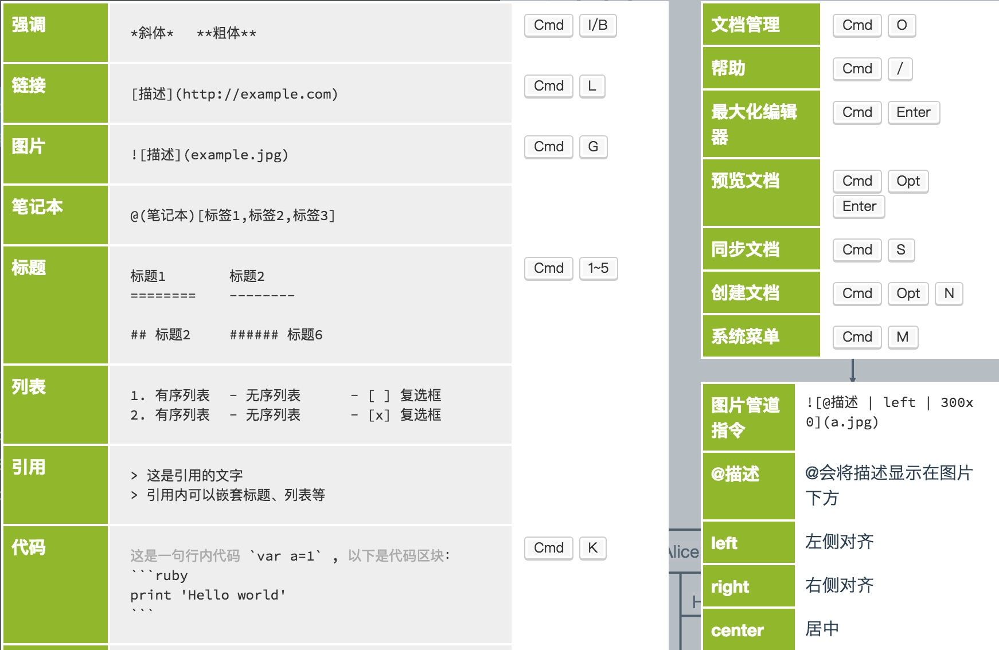

# 第一级标题 `<h1>`
## 第二级标题 `<h2>`
...
###### 第六级标题 `<h6>`

我是最高级标题
=
我是第二级标题
-

正文片段

**我可以变粗**,

*也可以变斜*,

***还可以又变粗又变斜***

<u>还可以加下划线</u>

~~也别忘了删除线~~.

[^脚注]
[^脚注]: 这是脚注的内容

>三个即三个以上的---或者***即可产生如下的分割线

---

>第一层引用

>>第二层引用

>>>第三层引用

>>>>第四层引用

`我会被小框框住哦`

```
这是一个代码块
```  
再指定所用代码的语言如JavaScript则会
```javascript
window.onload = function(...){...}
```  
又或者是SQL语言
```sql
SELECT * FROM table_name ORDER BY column LIMIT 1;
```  


1212
**表格**

column_id | column_name | column_password |
-|-|-
 01 | admin | admin_passwd |

 *注*  
  + markdown在需要换行的地方插入两个空格即可
  + markdown里html的标签也是有很多支持的就比如正文的下划线就是由标签`<u>`实现的

<b>如何插入图片</b>


脚注
===